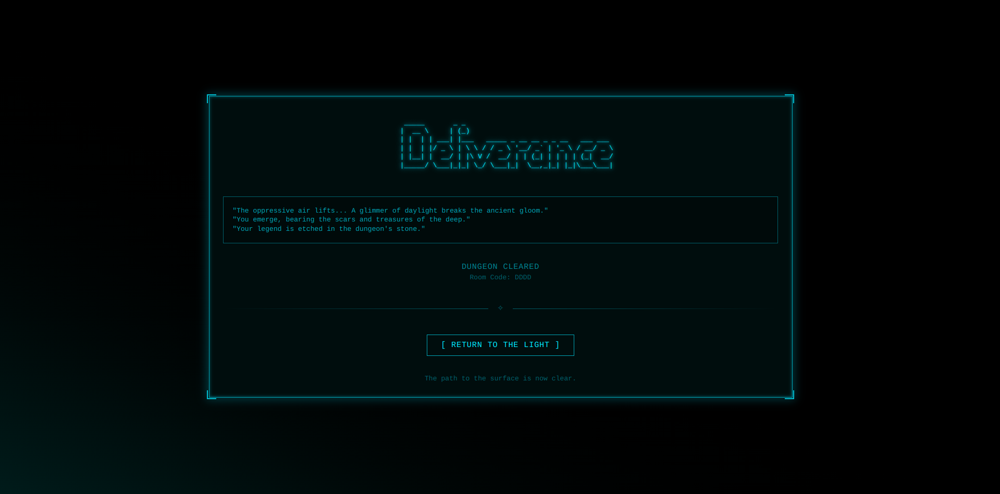

# Real-Time Multiplayer Roguelike Backend

This repository contains the complete backend server for a cooperative, multiplayer roguelike game.
Built entirely in Go, the server acts as the authoritative Game Master, managing multiple game sessions and providing a real-time, turn-based experience for connected clients.

---

## Technical Overview

### Core Responsibilities
- Procedural world generation
- Monster AI and combat resolution
- Player state management
- WebSocket-based client communication using a custom JSON protocol

---

## Technical Architecture

### Concurrency Model
- Built around Go’s native concurrency primitives.
- Each client connection runs in its own goroutine.
- A central per-session game loop processes player actions sequentially via channels, ensuring thread-safe, turn-based gameplay without complex locking.

### Networking
- Uses [gorilla/websocket](https://github.com/gorilla/websocket) for persistent, low-latency connections.
- Communication is handled via a custom JSON-based protocol that supports:
  - Lobby actions (`create`, `join`)
  - Player commands
  - Server-side state broadcasts

### Session Management
- Includes a Lobby Manager capable of running multiple isolated game sessions in parallel.
- Each room is identified by a custom 4-letter room code.
- Sessions support up to 5 players and are automatically cleaned up after completion to manage resources.

### Decoupled Packages

| Package | Responsibility |
|----------|----------------|
| `main` | Handles networking, client connections, and session management |
| `game` | Contains core game logic, rules, and entity definitions (players, monsters, items) |
| `dungeon` | Implements procedural world generation algorithms |

---

## Gameplay Features (Server-Side)

### Procedural Dungeon Generation
- Uses a Random Walk algorithm combined with a corridor-carving phase to ensure full map connectivity.
- Every session features a unique dungeon layout for replayability.

### Dynamic Monster AI
- Implements multi-state AI with configurable behaviors:
  - Wandering
  - Chasing
  - Attacking
  - Returning to territory
- Monsters vary in speed, vision, leash radius, and stats.

### Turn-Based Tactical Combat
- Supports both melee (bump attacks) and ranged combat systems.
- Includes weapons, armor, and durability systems.
- Features line-of-sight and range-based targeting for tactical depth.

### Interactive Fog of War
- The server computes a private fog-of-war view for each player.
- Includes a teamwork buff that increases a player's vision radius when near allies.

### Complete Gameplay Loop
- Fully playable game loop including:
  - Item pickups
  - Healing fountains
  - Cooperative win condition (reach the exit)
  - Individual loss (player defeat)
- Includes spectator mode for defeated players.

---

## Gameplay Showcase





---

## How to Run Locally (Clone, Install Dependencies, Run)

Follow the commands below to set up and run the server locally.

```bash
# 1. Clone the repository
git clone [https://github.com/Ankritjarngal/Dungeon-Crawler](https://github.com/Ankritjarngal/Dungeon-Crawler)
cd Dungeon-Crawler

# 2. Install dependencies (fetch required Go modules)
go mod tidy

# 3. Run the server
go run main.go